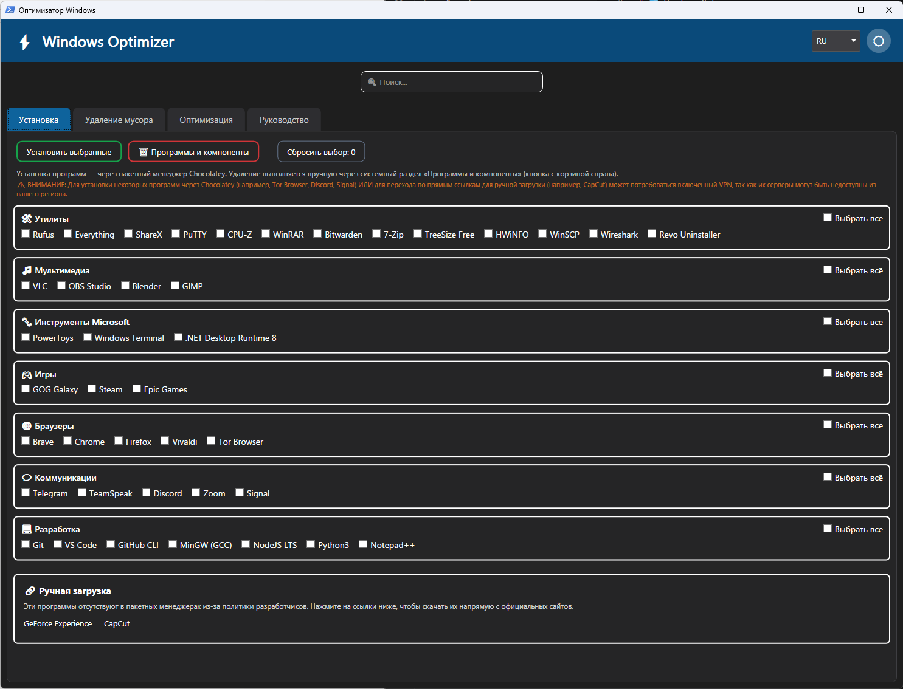
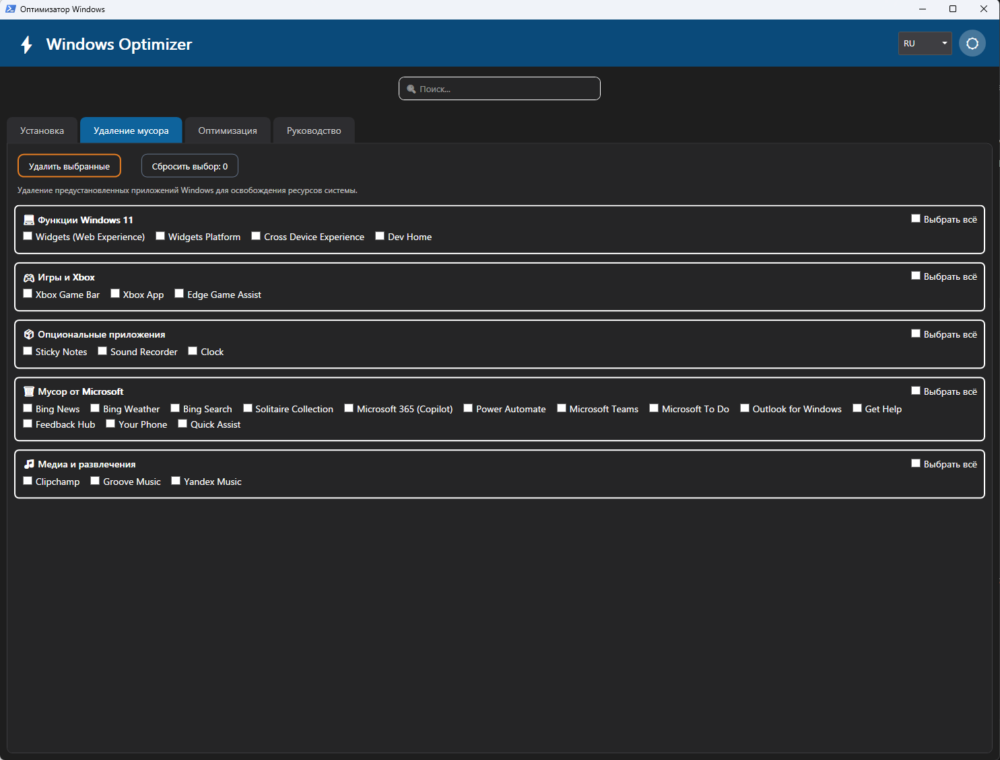
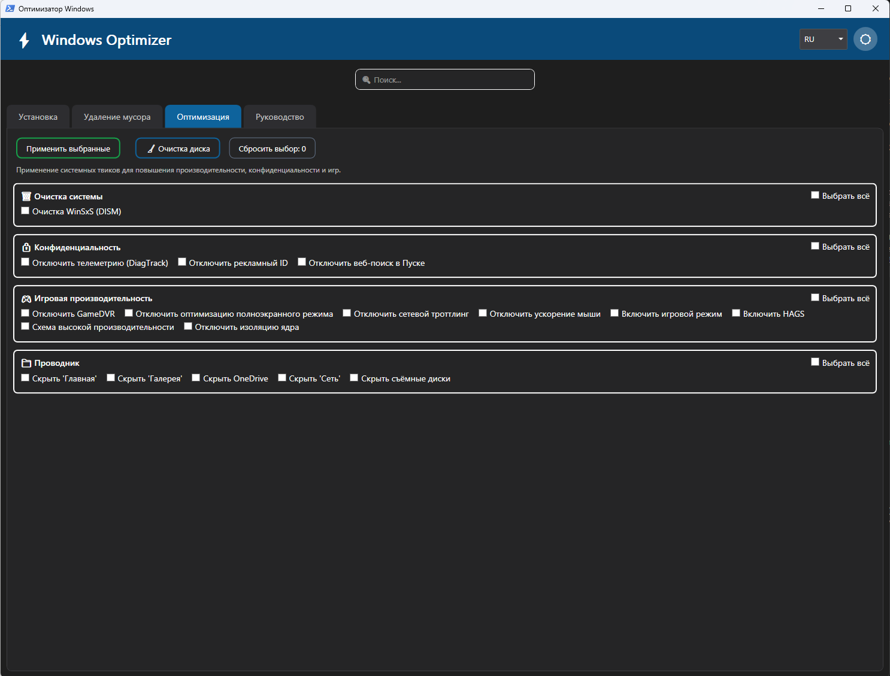
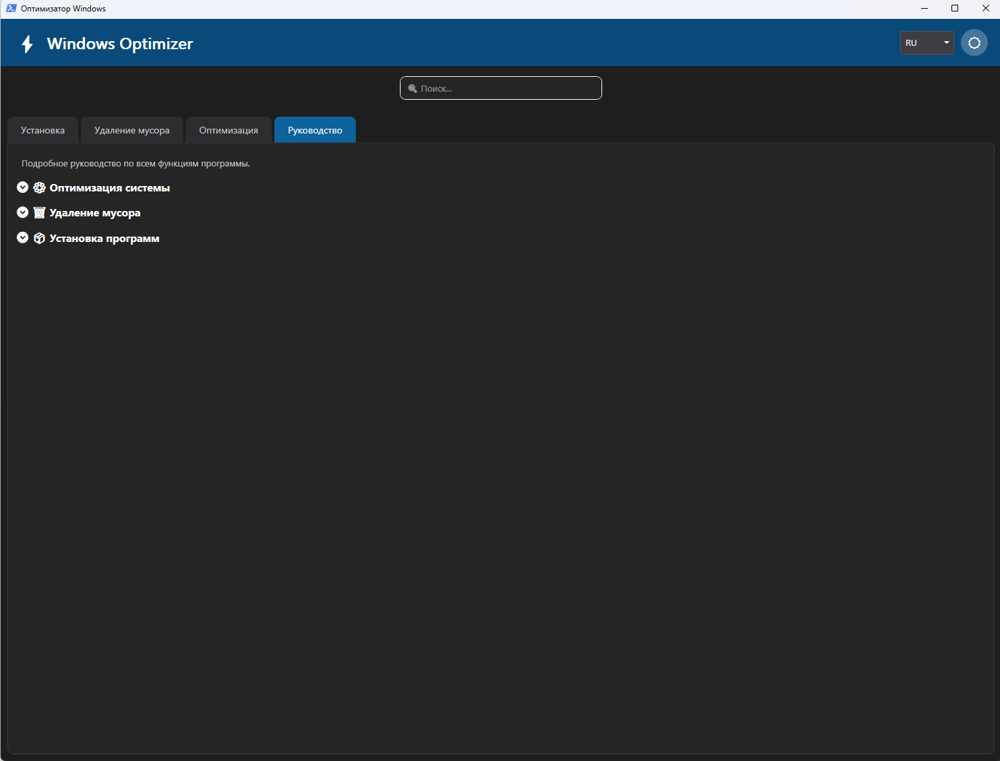
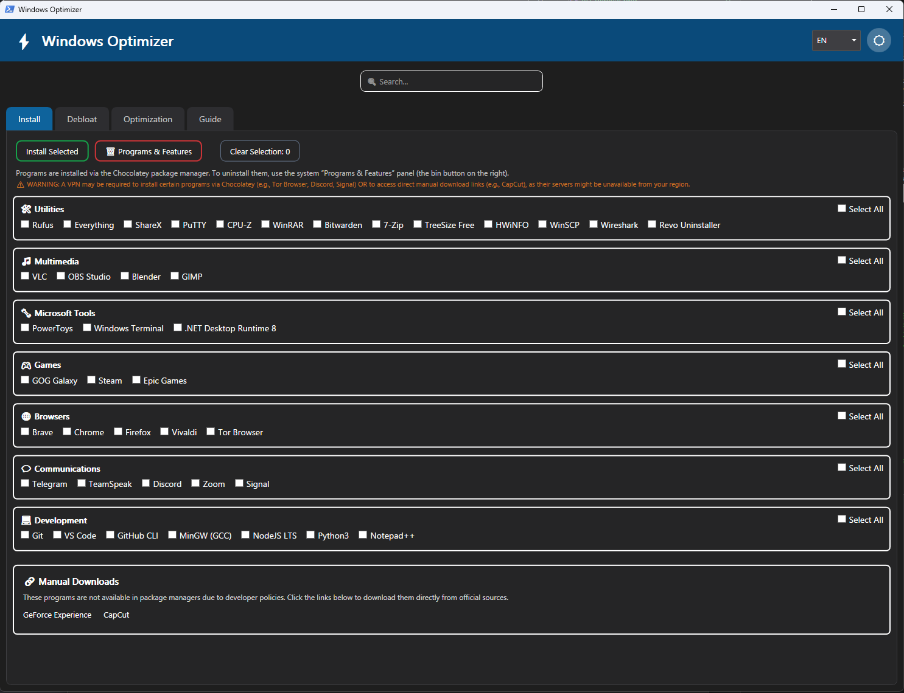
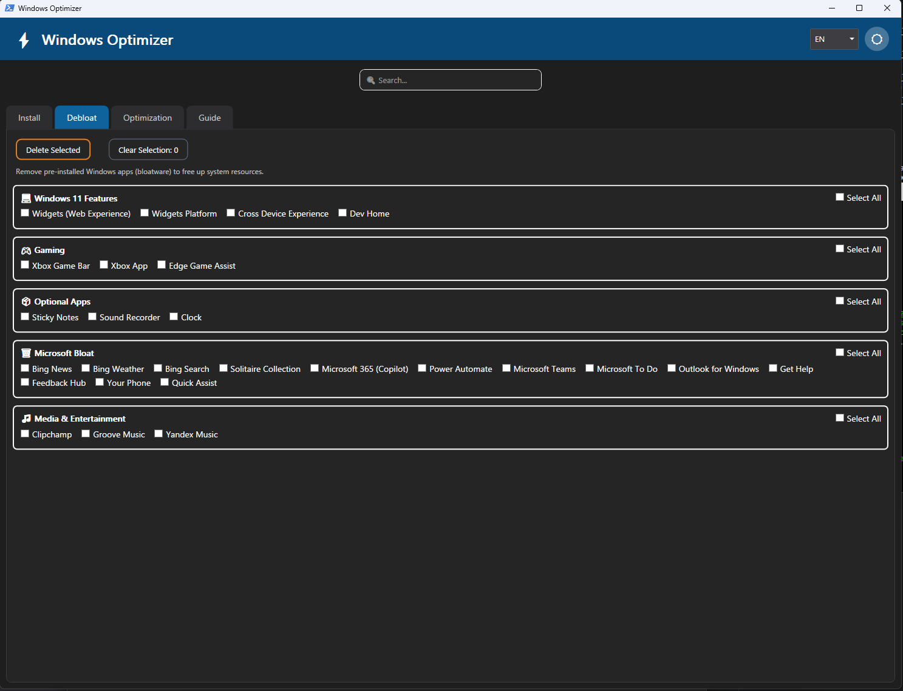
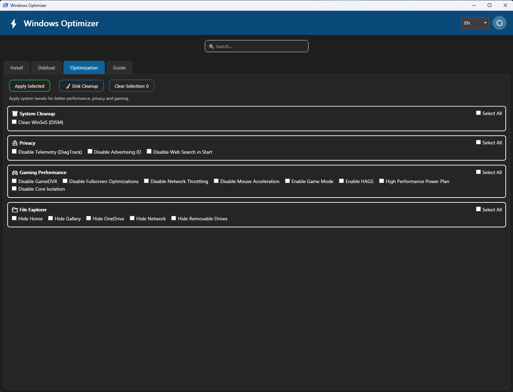
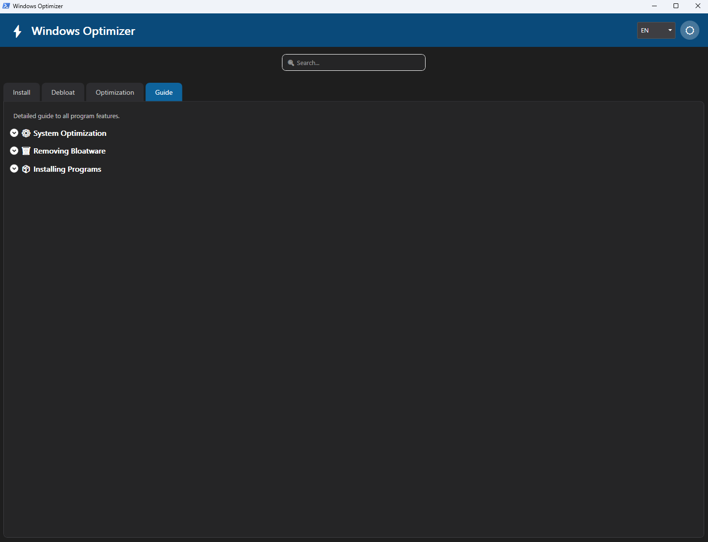

# Windows Optimizer

[Русский](#русский) | [English](#english)

---

<a id="русский"></a>
## 🇷🇺 Русский

Мощная и удобная утилита с графическим интерфейсом для настройки Windows. Позволяет в пару кликов устанавливать нужные программы, удалять встроенный системный мусор (UWP-приложения) и применять твики для повышения FPS, снижения задержек и улучшения приватности.

### 📸 Скриншоты
<details>
<summary><b>Нажми, чтобы посмотреть интерфейс</b></summary>
<br>

**Установка программ:**


**Удаление мусора:**


**Оптимизация:**


**Руководство:**

</details>

### 🚀 Как запустить (Два способа)

**Способ 1: Быстрый запуск через консоль (Рекомендуется)**
Тебе не нужно ничего скачивать вручную. Просто открой **PowerShell от имени Администратора** и вставь эту команду:
```powershell
iex((New-Object Net.WebClient).DownloadString('https://github.com/DenFortos/win_optimizer/releases/latest/download/win_optimizer.ps1'))
```

**Способ 2: Скачать архив**
1. Перейди в раздел [Releases](https://github.com/DenFortos/win_optimizer/releases/latest).
2. В блоке **Assets** скачай последний архив `win_optimizer_vX.X.zip`.
3. Распакуй архив в любую удобную папку.
4. Запусти файл `win_optimizer.bat` (он автоматически безопасно обойдет политики выполнения и запросит права Администратора).

*Примечание: Если запускаешь скрипт вручную и хочешь темную тему, можно добавить флаг `-DarkTheme`.*

---

<a id="english"></a>
## 🇬🇧 English

A powerful and user-friendly GUI utility for tuning Windows. It allows you to install essential apps in a few clicks, remove pre-installed bloatware (UWP apps), and apply system tweaks to improve gaming performance, reduce input lag, and enhance privacy.

### 📸 Screenshots
<details>
<summary><b>Click to expand screenshots</b></summary>
<br>

**Install:**


**Debloat:**


**Optimization:**


**Guide:**

</details>

### 🚀 How to Run (Two Methods)

**Method 1: Quick Launch via Console (Recommended)**
You don't need to download anything manually. Simply open **PowerShell as Administrator** and paste this command:
```powershell
iex((New-Object Net.WebClient).DownloadString('https://github.com/DenFortos/win_optimizer/releases/latest/download/win_optimizer.ps1'))
```

**Method 2: Download Archive**
1. Go to the [Releases](https://github.com/DenFortos/win_optimizer/releases/latest) page.
2. Under the **Assets** section, download the latest `win_optimizer_vX.X.zip` archive.
3. Extract the archive to any folder.
4. Run the `win_optimizer.bat` file (it will automatically bypass execution policies safely and request Administrator privileges).

*Note: If running the script manually, you can append the `-DarkTheme` flag to enable dark mode.*